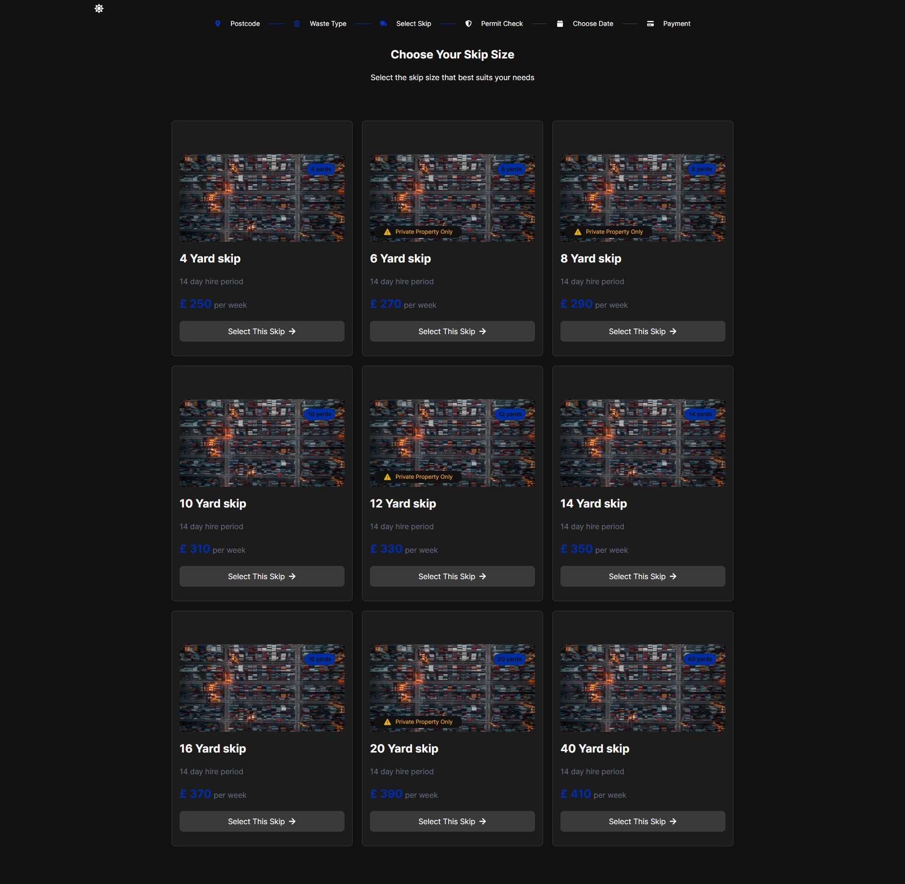
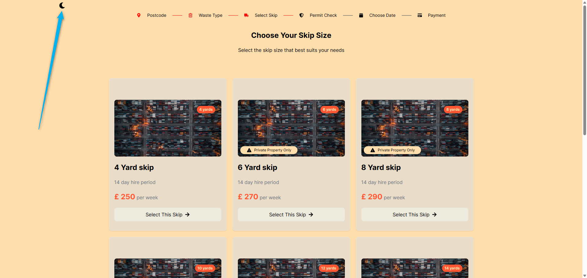

# REM Waste Management page redesign React Coding Challange

# A web page created using React.js and Tailwind CSS

This project's goal is to redesign the look and feel while keeping its functionality intact with the focus beign on clean code, resposiveness and UX/UI imporvements.

</img>

The page can be viewed at:

<a href="https://react-coding-challange-nu.vercel.app/" target=_blank>View the page</a>

I orded to crate the project I have decided to use Vite.js for it's fast frontend build power.

For styling, I have opted for Tailwind CSS since it is a perfect pair with React.

My approach was to create a few simple custom components for reusabillity and easier workflow. The goal was to make them as dynamic as possible.

- Button: a versatile button that can act as either a button element or a link element based on the presence of the href prop. It accepts additional class names, an onClick handler, children, and an optional icon. The styles and classes ensure a consistent look and feel for both buttons and links.

- Card: displays a list of cards using data from info.json. Each card shows information such as size, hire period, price, and whether it's private property. Clicking a card selects it, highlighting it with a border and displaying a checkmark. The Menu component is shown when a card is selected. The Button component updates based on the selection state.

- Hero: renders a section with a heading and a paragraph, centered

- Menu: displays a fixed menu at the bottom of the screen when a card is selected. It receives selectedCard and setSelectedCard as props. The menu shows the details of the selected card, including the price, size, and hire period. It also includes two buttons: "Back" to deselect the card and "Continue" to proceed with the selection.

- Navbar: a navigation bar with icons and text. The icons are imported from react-icons and mapped using the icons.json file. The component iterates over the icons array and dynamically renders each icon with corresponding text. It also includes horizontal rules (hr) between icons if specified. The icons and text have different styles based on their active state, making them clickable or not.

All the information was stored in info.json and icons.json files.

Another feature of the page is the theme switcher.

The theme can be changed by clicking the following icon:

</img>
